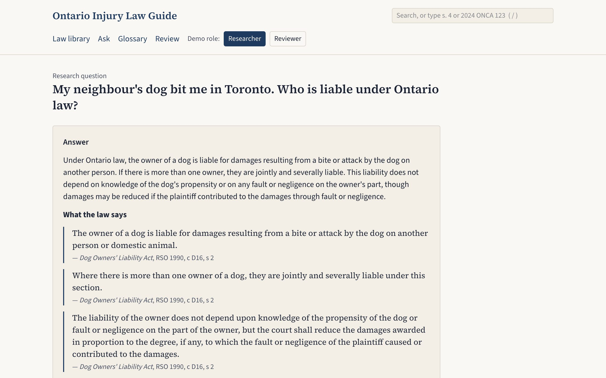
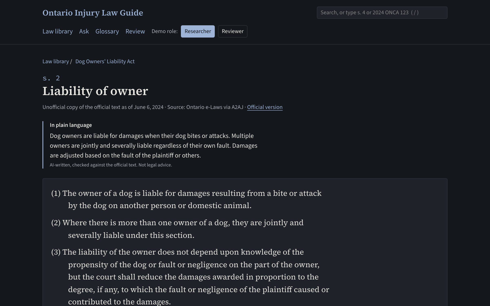
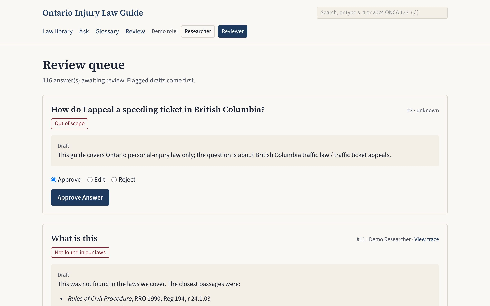
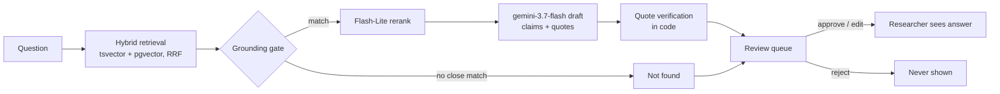

<p align="center">
  <picture>
    <source media="(prefers-color-scheme: dark)" srcset="docs/logo-dark.svg">
    
  </picture>
</p>

<p align="center">
  A research guide to Ontario personal-injury law for paralegals and law students. Ask a question in plain words; get
  an answer where <b>every sentence carries a quote that code has checked against the official text</b>, released
  only after a human reviewer approves it.
</p>

<p align="center">
  <a href="https://github.com/YichiZ/ai-lawyer/actions/workflows/ci.yml"></a>
  
  
  
  
  
  
  
  <a href="LICENSE"></a>
</p>

<p align="center">
  <a href="#user-flows">User flows</a> ·
  <a href="#what-keeps-an-answer-honest">Guarantees</a> ·
  <a href="#how-an-answer-is-made">Pipeline</a> ·
  <a href="#quick-start">Quick start</a> ·
  <a href="#tests-and-quality-gates">Evals</a> ·
  <a href="docs/design.md">Design doc</a> ·
  <a href="docs/iterations.md">Build log</a>
</p>

<p align="center">
  
</p>

<p align="center">
  
  
</p>

> **Portfolio demo. Not legal advice.** The app gives no outcome predictions, no claim values and no computed deadlines,
> and no answer reaches a researcher without a reviewer's approval.

## What it does

- **Law library:** 20 Ontario statutes and regulations, Toronto Municipal Code ch. 629, 719 and 743 (excerpts only,
  City copyright), and 1,660 Court of Appeal and Supreme Court of Canada injury decisions from the open
  [A2AJ](https://huggingface.co/a2aj) datasets. Each section has a plain-language summary, glossary terms and a list of
  the decisions that cite it.
- **Search:** one box with typeahead, citation jumps (`LA s. 4`, `2016 ONCA 585 at para 12`) and hybrid keyword and
  vector search.
- **Ask:** sources come back in under a second; the draft is written in the background and goes to the review queue.
  If the library has no close match, the grounding gate says "not found" without calling the model.
- **Review:** the reviewer approves, edits or rejects each answer. Risky drafts (dropped claims, not found, web
  answers) come first.
- **Web fallback:** an opt-in Google Search answer, labelled "from the web" and reviewed like any other. The reviewer
  can add official pages (ontario.ca, canada.ca, ontariocourts.ca, scc-csc.ca, toronto.ca) to the library through a
  Redis Streams worker that obeys robots.txt and fetches at most 1 request/s.
- **Topic guides:** 5 practice areas. Each section is drafted by the answer pipeline and shown only after review.

## User flows

There is no login: switch between the two demo roles, **Researcher** and **Reviewer**, in the page header. The three
flows below cover most of what the app does. The examples come from the local app on the full corpus (2026-09-26); all
ten flows, with their acceptance criteria, are in [docs/user-flows.md](docs/user-flows.md).

### 1. Find the law

Search with a citation or with everyday words (press `/` anywhere to focus the box), then read the section.

| You type | You get |
|---|---|
| `LA s. 4` | A jump straight to *Limitations Act, 2002* s. 4, "Basic limitation period" |
| `2024 SCC 32 at para 3` | *Scott v. Golden Oaks Enterprises Inc.*, opened at paragraph 3 |
| `slip and fall on ice` | *Occupiers' Liability Act* s. 6.1 (written notice within 60 days for snow and ice injuries) and Toronto Municipal Code ch. 719, *Snow and Ice Removal* (§ 719-2: clear the sidewalk within 12 hours), even though the query uses none of their words |

The section page for *Limitations Act, 2002* s. 4 shows:

- the official text;
- an **In plain language** summary, labelled as AI-written and not legal advice;
- the glossary terms it uses ("proceeding", "claim", "discovered"), each linked to the section that defines it;
- **Cited by 103 decisions**, each opening the decision paragraph by paragraph;
- **Copy citation**, which copies *Limitations Act, 2002*, SO 2002, c 24, Sched B, s 4.

*Guarantee:* Toronto by-laws are City copyright. The page and the API show only a short excerpt (at most 300
characters) with a link to the official PDF.

### 2. Ask a question, the reviewer approves it, the researcher reads it

The researcher asks in plain words and sees the sources in under a second. The draft is written in the background
and goes to the review queue. The reviewer approves, edits or rejects it, and only then does the researcher see it.

1. **Ask:** "How long do I have to sue after a slip and fall on a Toronto sidewalk?"
2. **Answer page, at once:** the sources found (*City of Toronto Act, 2006* s. 42, *Occupiers' Liability Act* s. 6.1,
   ch. 719, related Court of Appeal decisions) and **Awaiting review**. The researcher cannot see the draft.
3. **Reviewer → Review:** the draft appears with a table of claims, each with its verified quote and pinpoint. Flagged
   drafts (dropped claims, not found, web answers) come first. **Approve**, **Edit** (with a note) or **Reject** (with
   a reason).
4. **Researcher refreshes:** the approved answer, with citation chips that show each quote, and "Reviewed by … on …".

**Illustrative example** of the shape of an approved answer (abridged, not legal advice; the quotes are copied from the
library):

> In general, a proceeding cannot be started more than two years after the claim was discovered:
>
> > Unless this Act provides otherwise, a proceeding shall not be commenced in respect of a claim after the second
> > anniversary of the day on which the claim was discovered.
>
> — *Limitations Act, 2002*, SO 2002, c 24, Sched B, s 4
>
> For a claim against the City about the repair of a highway, written notice must reach the city clerk much sooner:
>
> > No action shall be brought for the recovery of damages under subsection (2) unless, within 10 days after the
> > occurrence of the injury, written notice of the claim and of the injury complained of, including the date, time
> > and location of the occurrence, has been served upon or sent by registered mail to, (a) the city clerk; …
>
> — *City of Toronto Act, 2006*, SO 2006, c 11, Sched A, s 42(6)
>
> Missing the notice is not a bar if a judge finds a reasonable excuse and the City is not prejudiced (s 42(8)).

The answer states the rules; it never works out a date or says whether someone has a case. When an answer can quote a
statute only through a court decision (e.g. *Municipal Act, 2001* s. 44 as quoted in *Crinson v. Toronto (City)*,
2010 ONCA 44), it carries the label "**Statute quoted in a court decision — not in our law library.** The wording below
comes from the decision; check the current version of the statute before relying on it." and the reviewer sees the
draft flagged.

*Guarantee:* each quote must appear word for word in its source, or the claim is dropped in code. If the library has
no close match, the grounding gate answers "not found" without calling the model. No draft reaches a researcher
without a reviewer's approval.

### 3. When the library has no answer

The researcher can choose to search the web; nothing is searched automatically. The reviewer can then add official
pages to the library so the next question is answered from it.

1. **Ask** something outside the library, e.g. the rules for flying a drone near Pearson airport. The page says *Our law
   library has no close match for this question* and offers **Search the web instead**.
2. That makes a Google Search–grounded draft labelled *Web search answer — not from our law library*, with each source
   and its domain. It goes to the review queue flagged as a web answer and is reviewed like any other.
3. In the queue, sources on ontario.ca, canada.ca, ontariocourts.ca, scc-csc.ca and toronto.ca get **Add to library**;
   every other source is marked "not an official source; cannot be added".
4. **Add to library** queues a job (`make worker` must be running). The worker checks robots.txt, fetches the page at
   no more than 1 request/s, splits it into sections and embeds them. The page then appears under *Law library →
   Official web pages* and in search. In one run a Transport Canada page became 7 sections within seconds.

*Guarantee:* web answers are always labelled and always reviewed, and only official government and court pages can
enter the library.

Also in the app: 5 topic guides (motor vehicle accidents, slip and fall, claims against the City, dog bites,
limitation periods), each shown only after review, and a plain-language glossary.

## What keeps an answer honest

A legal research tool is only useful if you can trust what it quotes. These rules are enforced in code and tested,
not left to the prompt:

| Guarantee | Enforced by | Tested in |
|---|---|---|
| **A quote must appear word for word in its source.** Claims whose quote is not an exact (whitespace-normalized) substring of a retrieved chunk are dropped before anyone sees them. | [`verify_claims`](app/ask.py) | [`tests/test_ask.py`](tests/test_ask.py) |
| **Every quote is pinned to its subsection or paragraph**, so a citation points at the exact words, not just the Act. | [`pinpoint_claims`](app/ask.py) | [`tests/test_load_statutes.py`](tests/test_load_statutes.py), [`tests/test_cases.py`](tests/test_cases.py) |
| **No close match, no answer.** A grounding gate refuses before the model is called, so it cannot fill the gap from memory. | [`run_ask`](app/ask.py) | [`tests/test_ask.py`](tests/test_ask.py) |
| **A human approves every answer.** Drafts default to `pending_review`, and researchers cannot see them until a reviewer approves. | [`db/schema.sql`](db/schema.sql), [`app/review.py`](app/review.py) | [`tests/test_review.py`](tests/test_review.py) |
| **No legal advice.** No "you have a case", outcome predictions, claim values or computed deadlines; an LLM judge scores every eval answer for it. | [`evals/answers.py`](evals/answers.py) | `no_advice` 1.00 on the gold set |
| **Copyright is respected.** City of Toronto bylaws are indexed but only short excerpts with the official link are ever returned; CanLII is never scraped. | [`app/laws.py`](app/laws.py) | [`tests/test_api.py`](tests/test_api.py), [`tests/test_web_ingest.py`](tests/test_web_ingest.py) |

## How an answer is made



Sources come back to the researcher in under a second; drafting runs in the background because Gemini's latency tail
is long (see [Known limits](#known-limits)).

## Stack

Python 3.13 + uv · FastAPI · Postgres 18 + pgvector + tsvector + pg_trgm · Redis 8 Streams (job dispatch; job state in
Postgres) · Vertex AI via Application Default Credentials (`gemini-3.7-flash`, `gemini-3.5-flash-lite`,
`gemini-embedding-2` at 1536 dims) · Langfuse Cloud (tracing and evals) · Next.js 16 + Tailwind 4 · Playwright, axe and
Lighthouse CI · Docker Compose.

The design, its trade-offs and the milestones are in [docs/design.md](docs/design.md). Every iteration, with its
numbers, is logged in [docs/iterations.md](docs/iterations.md).

## Quick start

Prerequisites: Docker, [uv](https://docs.astral.sh/uv/), Node 24, `pdftotext` (`brew install poppler`) and the
`gcloud` CLI with access to a Google Cloud project that has Vertex AI enabled.

```bash
gcloud auth application-default login
gcloud auth application-default set-quota-project <your-project>
uv sync && npm ci --prefix web
make db                              # Postgres + Redis in Docker, schema applied
uv run -m scripts.check_vertex       # Vertex smoke test (6 checks)
```

Optional: put Langfuse Cloud keys in a gitignored `.env` (`chmod 600`) to turn on tracing and evals:

```bash
LANGFUSE_PUBLIC_KEY=pk-lf-...
LANGFUSE_SECRET_KEY=sk-lf-...
LANGFUSE_BASE_URL=https://us.cloud.langfuse.com
```

There are no Google API keys: Vertex AI uses ADC only.

### Build the corpus

Each script is idempotent: it only redoes work whose source hash changed. The fetch scripts download from A2AJ
(Hugging Face) and toronto.ca, and record a sha256 and a manifest line for every file in `input/manifest.jsonl`.

```bash
uv run -m scripts.fetch_a2aj && uv run -m scripts.load_statutes        # statutes and regulations
uv run -m scripts.fetch_toronto && uv run -m scripts.load_toronto      # Toronto Municipal Code
uv run -m scripts.fetch_a2aj --caselaw && uv run -m scripts.load_caselaw
uv run -m scripts.contextualize_chunks && uv run -m scripts.embed_chunks
uv run -m scripts.summarize_sections && uv run -m scripts.summarize_cases
uv run -m scripts.build_glossary && uv run -m scripts.build_citations
uv run --env-file .env -m scripts.build_guides                          # drafts go to the review queue
```

The LLM steps (context, summaries, guides) cost a few dollars on Vertex AI; the context and summary scripts print an estimate first.

### Run

```bash
make api      # FastAPI on http://localhost:8000 (/docs)
make worker   # ingest worker for "Add to library" jobs
make web      # Next.js on http://localhost:3000
```

Switch between the **researcher** and **reviewer** demo roles in the page header.

## Tests and quality gates

```bash
make test          # pytest against a fresh ai_lawyer_test DB (needs Redis for the job-queue tests)
make e2e-ci        # Playwright + axe against a fresh fixture-only DB, fake model (as in CI)
make lighthouse    # production build + Lighthouse budgets
make eval          # gold-set experiments in Langfuse vs evals/baseline.json (local only; uses Vertex)
```

- **Evals** (62 gold questions, 15 out of scope):
  - retrieval: recall@8 1.00, MRR 0.91
  - answers: verified-claim rate 1.00, facts covered 0.98, citation supported 0.95, no advice 1.00
  - summaries: faithful 0.98

  The gate fails on a drop of more than 2 points (5 points for LLM-judge metrics) or on a change to the corpus or gold
  hash.
- **CI** (GitHub Actions): unit/integration tests, Playwright end-to-end tests with axe on 10 pages × 2 themes, and
  Lighthouse (accessibility 100, CLS 0).
- **Load test:** see [loadtest/locustfile.py](loadtest/locustfile.py) and the results in
  [docs/iterations.md](docs/iterations.md).

## Layout

```
app/        FastAPI API: retrieval, answering, review, job queue, web fallback
ingest/     parsers and loaders (A2AJ statutes and cases, Toronto PDFs, web pages), chunking, Vertex clients
evals/      gold set, metrics, baseline gate, CI fixture
scripts/    fetch / load / embed / summarize / eval / worker entry points
web/        Next.js app and Playwright specs
db/         schema.sql (idempotent)
loadtest/   locust scenarios
docs/       design doc, phase plans, iteration log
```

## Data and licences

- Code: [MIT](LICENSE). The MIT licence covers the code only; every dataset keeps its own licence, listed below.
- A2AJ datasets: each document keeps its `upstream_license`, shown on its page.
- Toronto Municipal Code: © City of Toronto. The app indexes it locally and shows short excerpts with a link to the
  official PDF.
- Web pages: only the five official domains above can be added. Each page is stored with its source and a licence note.
- CanLII: nothing is ever downloaded in bulk or programmatically. Ontario Superior Court decisions are not in A2AJ, and
  the case pages say so.

## Known limits

- **Answer drafts are slow:** p95 is 11.4 s against an 8 s target. The time is Gemini generation on Vertex AI.
- **Pages are heavier than the design target:** LCP is about 2.5 s and JavaScript about 140 KB, against 1.5 s and 100 KB.
- **Decision summaries are hard to read:** they average grade 13.4, against a target of 8–10.
