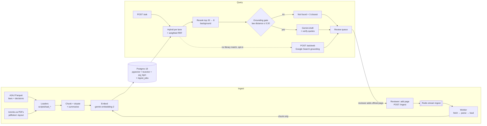
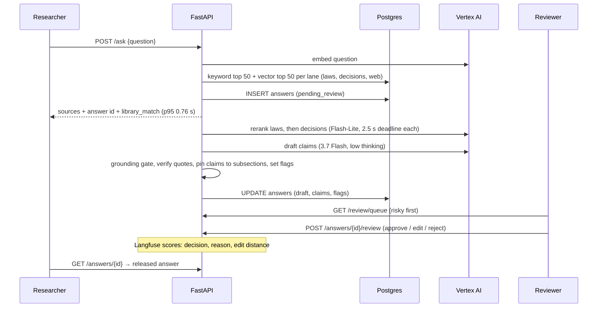

# Ontario Injury Law Guide — Design Doc

Sep 25, 2026 · updated Sep 27, 2026 to match the code · Yichi Zhang · Live version: https://claude.ai/artifact/1eXMcx8vLmKPCRgCxgPpLn

We will build a research guide to Ontario personal-injury law, plaintiff side and Toronto-focused, for paralegals and law students: browse every relevant law, search it in everyday or legal words, and ask research questions whose answers a human reviewer approves before release. It is a portfolio demo. All six phases below are built. The library holds 20 laws (15 statutes, 5 regulations; 3,871 sections), 3 Toronto Municipal Code chapters, 1,660 Ontario Court of Appeal and Supreme Court of Canada decisions from the open A2AJ dataset, and official web pages a reviewer adds — 42,891 chunks in all.

Where the build differs from the original plan, the section says so; features planned but not built are listed under **Not built** in each section.

## Goals and non-goals

A paralegal or law student new to Ontario injury law should be able to find the laws that apply, understand them quickly, and get research answers a reviewer has approved — with every statement traceable to the official text.

**Goals**

1. Topic guides for 5 practice areas: the deadlines, elements and laws that apply, in plain but precise language.
2. Browse every law in the corpus, with a plain-language summary beside the official text.
3. Search laws, cases, guides and glossary from one box, in everyday words ("slip and fall") or legal ones ("occupier", "s. 4").
4. Answer research questions with verified quotes and pinpoint citations; say "not found" instead of guessing.
5. Human in the loop: a reviewer approves, edits or rejects every chat answer before the researcher sees it.
6. Ingest open bulk data (A2AJ) plus targeted web downloads into `input/` with provenance, idempotently.
7. Measure retrieval, answer, summary and review quality in Langfuse, with a regression gate.

**Non-goals (v1)**

- Advice to the public, outcome predictions or claim values.
- A deadline calculator: guides state the rules, never a computed date.
- Other provinces, criminal, employment, and family law beyond injury-related family claims.
- Bulk scraping CanLII or any login- or paywall-gated source.
- French.
- A public launch: this is a portfolio demo with two seeded roles (researcher, reviewer) — no real accounts, billing or fine-tuning.

## Requirements

The binding targets are citation accuracy ≥ 95% and p95 answer latency under 8 s. Targets were set before Phase 2; the last column is the latest measurement: latency from the Phase 6.3 load test (the eval harness's own timings in `evals/baseline.json` are slower because it runs drafts inline), quality from `evals/baseline.json`. Both binding targets are narrowly missed.

| Area | Requirement | Target | Measured |
| --- | --- | --- | --- |
| Corpus size | Pages indexed without code changes | 1M pages (~3M chunks) | 42,891 chunks; not load-tested at 1M |
| Freshness | Added web page searchable | < 5 min | ~2 s per page through the worker |
| Query latency | p95 time to sources / draft answer | < 2 s / < 8 s | 0.76 s ✅ / 11.4 s ❌ (Vertex generation time) |
| Retrieval quality | recall@8 on gold set | ≥ 0.85 | 1.000 (MRR 0.908) |
| Citation accuracy | Cited span supports the claim (LLM judge) | ≥ 95% | 94.7% ❌ (verified-quote rate 99.5%) |
| Refusal | Out-of-scope questions correctly refused | ≥ 90% | 100% (18 items) |
| Idempotency | Re-ingesting the same file | No new rows, no new embeddings | Held on every rerun |
| Provenance | Every chunk traces to a source URL and hash | 100% | Held |

The original ingestion-throughput target (≥ 20k pages/h) was never measured: the real corpus loads in minutes.

## Architecture

Two paths share one Postgres: an ingest path that turns documents into indexed chunks, and a query path that retrieves, reranks and drafts answers with verified citations for human review.

**`/ask` request flow.** Sources come back at once; drafting runs in a background task, and the researcher sees the answer only after review.

| Component | Choice | Why |
| --- | --- | --- |
| API | FastAPI, one `{data, error, meta}` envelope | Async, typed; background tasks for drafts |
| Frontend | Next.js App Router (server-rendered per request) + Tailwind 4 | Fast, shareable, printable pages |
| Queue / workers | Redis 8 Streams + consumer group; job records in Postgres | Fast dispatch and worker scale-out; Postgres keeps durable job state (see Job queue) |
| Parsing | A2AJ arrives pre-structured; `pdftotext -layout` for PDFs; stdlib `HTMLParser` for web pages | Only 3 PDFs and a handful of pages: no new dependency. Docling (planned) was not needed — superseded |
| Store | Postgres 18 + pgvector 0.8 (HNSW halfvec) + tsvector + pg_trgm | Vectors, keywords, typeahead, metadata and job records in one system |
| Embeddings | gemini-embedding-2 at 1536 dims | One content per request, so bulk runs use a thread pool (~27 chunks/s) |
| Reranker | gemini-3.5-flash-lite, listwise (JSON ranking of passage ids) | One vendor, one auth path; tuned by eval |
| Chunk context | gemini-3.5-flash-lite, law title + Part outline in the prompt | Cheap; laws and web pages only (planned context caching not needed) |
| Answers, section summaries, glossary | gemini-3.7-flash (low thinking) + verified quotes | Citations checked in code |
| Decision summaries, eval judge | gemini-3.5-flash-lite | 1,660 decisions for ~$3.50 |
| Web fallback | Grounding with Google Search, opt-in | Built into Gemini |
| Evals + tracing | Langfuse Cloud (managed) | Datasets, experiments, LLM judges and traces in one place |
| Deploy | Docker Compose (Postgres, Redis) + `make api` / `make web` / `make worker` | One command per process |

**Google Cloud access.** All Gemini calls go through Vertex AI, authenticated with Application Default Credentials — no Google API keys anywhere. The only keys are Langfuse Cloud's public/secret pair, read from the environment (local `.env`, gitignored; CI secrets), never committed. Traces hold questions and public law text only — no personal data.

- One client everywhere: `google-genai` with `genai.Client(vertexai=True, project=GOOGLE_CLOUD_PROJECT, location="global")` (`ingest/vertex.py`).
- Local: `gcloud auth application-default login` + `set-quota-project`. CI runs on a fake model (`AI_FAKE=1`), so it needs no Google credentials.
- `scripts/check_vertex.py` smoke-tests generation (3.7 Flash, 3.5 Flash-Lite), a 1536-dim embedding, structured claims with quote verification, Google Search grounding, and a listwise rerank.

**Model call rules (learned in testing):** 3.7 Flash, not 3.8 (3.8 504'd on most calls on `global`, 404 in `us-central1`). Always `thinking_level="low"` unless a task needs deep reasoning: default thinking made grounding search until the deadline. The app client has a 30 s timeout and SDK retries on 429/5xx; bulk jobs use a patient client (60 s, 8 attempts); the interactive rerank gets one 2.5 s attempt. Grounding source URLs are Vertex redirects and are resolved from the `Location` header before storing.

## Acquisition

A2AJ's open Parquet datasets are the primary source; toronto.ca PDFs and reviewer-added pages fill the rest. Every download lands in `input/` with a line in `input/manifest.jsonl` (one line per Parquet file, PDF or web page, with its sha256). Fetch scripts are run by hand and are idempotent: A2AJ files are skipped when Hugging Face's `x-linked-etag` matches the manifest sha256, toronto.ca PDFs by `Last-Modified`.

| Source | What | Access | Loaded |
| --- | --- | --- | --- |
| [a2aj/canadian-laws](https://huggingface.co/datasets/a2aj/canadian-laws) | 20 Ontario injury statutes and regulations, pre-split into sections | Hugging Face Parquet (`scripts/fetch_a2aj.py`) | 20 laws, 3,871 sections |
| toronto.ca | Toronto Municipal Code ch. 719 (Snow and Ice Removal), 743 (Streets and Sidewalks), 629 (Property Standards) | Approved download (2.6 MB PDFs). **City copyright: local index only — UI shows excerpts + link, never full text** (`documents.reproduction = 'excerpt'`). Plain-language summaries stay (decided 2026-09-27, #16): our own paraphrase, labelled AI-written with the official link | 3 chapters, 126 sections |
| [a2aj/canadian-case-law](https://huggingface.co/datasets/a2aj/canadian-case-law) | ONCA (24,131 decisions) and SCC (10,893), filtered to injury law | Hugging Face Parquet (`fetch_a2aj.py --caselaw`), with citation lists | 1,660 decisions, 79,689 paragraphs |
| Official web pages | ontario.ca, canada.ca, ontariocourts.ca, scc-csc.ca, toronto.ca | Reviewer adds one page at a time (see Add-to-corpus) | 2 pages |
| [CanLII API](https://github.com/canlii/API_documentation/blob/master/EN.md) / full text | Superior Court and LAT decisions | Bulk download prohibited by [CanLII terms](https://www.canlii.org/info/terms.html) | Not requested; gap stated on every case page |

**Laws:** Limitations Act, 2002 · Negligence Act · Occupiers' Liability Act · Dog Owners' Liability Act · Insurance Act and O. Reg. 34/10 (SABS) · Highway Traffic Act · Courts of Justice Act · Rules of Civil Procedure (R.R.O. 1990, Reg. 194) · Family Law Act · City of Toronto Act, 2006 · Workplace Safety and Insurance Act, 1997 · added in #6: Municipal Act, 2001 · Trespass to Property Act · Motor Vehicle Accident Claims Act · Compulsory Automobile Insurance Act · Health Insurance Act · O. Reg. 461/96 · O. Reg. 239/02 · O. Reg. 612/06.

**Case filter** (`ingest/caselaw.py`): ONCA civil decisions and SCC decisions from 1970, kept if they cite an injury statute or use ≥ 3 injury terms including an injury-specific one → 1,297 ONCA + 363 SCC. (A looser first rule kept 3,949 with poor precision.)

**Rules:** bulk datasets before scraping; no bulk or programmatic download from CanLII (it is suing Caseway AI over exactly that); respect each document's `upstream_license` (A2AJ case law is non-commercial, shown on case pages); robots.txt and ≤ 1 request/s per domain; approval table before every download batch; never enter credentials.

## Ingestion and chunking

Chunks follow the law's own structure — Act > Part > section > subsection for statutes, numbered paragraphs for decisions — so every citation can pinpoint "s. 4(1)" or "at para 45".

1. **Load** — `scripts/load_statutes.py`, `load_toronto.py`, `load_caselaw.py`. A document is skipped when its hash (source + `PARSER_VERSION`) is unchanged; a changed document updates sections in place by pinpoint, so summaries and citation links survive a reload (#9).
2. **Parse** — A2AJ laws are Markdown + a JSON section map; section headings come from e-Laws marginal notes (`ingest.statutes.section_heading`). Decisions split on the `[N]` paragraph sequence; 189 older decisions without numbers split on line boundaries. By-laws: `pdftotext -layout`, lines rejoined into paragraphs.
3. **Chunk** (`ingest/chunks.py`) — statutes: one chunk per section, split at subsections past 3,200 chars (~800 tokens). Decisions: windows of whole paragraphs ≤ 2,000 chars. Each chunk keeps its section ids and pinpoint; `sync_chunks` reuses embeddings by text hash.
4. **Situate** — Flash-Lite writes 1–2 sentences placing each law or web chunk (title + Part outline). Used in the embedding input only; keyed by chunk hash, so a heading change forces a re-situate — read the estimate first.
5. **Summarize** — section summaries (3.7 Flash, grade ≤ 10 target), decision summaries (Flash-Lite on a ≤ 24k-char excerpt: headnote, first 30 and last 5 paragraphs), glossary definitions from the defining section, each validated by a shared non-answer detector before storing.
6. **Extract citations** (`ingest/citations.py`) — statute references by regex (both word orders); case-to-case links from A2AJ citation lists → 10,841 links.
7. **Embed** — gemini-embedding-2, one request per chunk across a thread pool, committed every 25 so a crash resumes.

A chunk is keyword-searchable once written and vector-searchable once embedded. Every batch script prints a cost estimate first (LLM jobs are scoped by document kind).

### Job queue

Redis dispatches work; Postgres remembers it (`app/jobs.py`, `scripts/worker.py`). This follows Slack's lesson that Redis should hold dispatch state, not the durable backlog.

1. **Enqueue** — insert an `ingest_jobs` row (`queued`), then `XADD` its id to the `ingest` stream (`MAXLEN ~ 100000`). The id is the sha256 of `(kind, url)`, so a duplicate enqueue is a no-op; re-enqueueing a `dead` job resets and redispatches it.
2. **Dispatch** — workers `XREADGROUP` in one consumer group and `XACK` after the data commits.
3. **Recover** — every 30 s a sweeper `XAUTOCLAIM`s entries idle > 5 min, and a reconciler re-adds due retries, stale `running` rows and `queued` rows Redis lost. Tested by deleting the stream with jobs queued.
4. **Retry / dead-letter** — failures back off 1, then 4 min; the third failure is `dead` with `error` and `stage`, copied to `ingest:dead`. Refusals (domain, robots.txt, 4xx, unsupported type) are dead at once.
5. **Idempotent** — delivery is at-least-once; loading is keyed on sha256, so a rerun adds no rows and no embeddings.

**Redis config** (`docker-compose.yml`): AOF `appendfsync everysec`, 256 MB `maxmemory` with `noeviction`, so a full Redis rejects enqueues instead of dropping jobs. `socket_timeout` is set above the 5 s block time.

**Add-to-corpus.** A reviewer adds an official page from a web-fallback answer: https on the five official domains only (redirects checked before they are followed), robots.txt obeyed, ≤ 1 request/s per host. Stages `fetch → parse → load → chunk → embed`; file kept in `input/web/` with a manifest line; HTML split on h2/h3 (menus and link-only blocks dropped), PDFs by page; toronto.ca stays excerpt-only. The allowlist says nothing about relevance (a Transport Canada drone page passed it, #8), so the reviewer must confirm scope: `POST /ingest {url, in_scope: true}` (422 without it), recorded in `ingest_jobs.scope_confirmed_by`. `DELETE /laws/{slug}` (reviewers, kind `web` only, 409 otherwise) removes a page with its sections, chunks and job row; the file and manifest line stay.

**Not built:** a scheduled A2AJ refresh or an `input/` watcher (fetches are manual); situating and summaries for added web pages (the worker only chunks and embeds).

## Retrieval

Measured in Phase 3 against the gold set; `docs/iterations.md` has every delta, kept or reverted. Code: `app/ask.py`, `app/rerank.py`.

1. **Lanes** — each kind of source is ranked on its own: laws (statutes, regulations, by-laws; `RETRIEVAL_KINDS`) give the top 8; decisions the top 4 (mixing them in dropped statute recall@8 1.000 → 0.935); reviewer-added web pages the fused top 2, kept only within distance 0.30 (an ontario.ca Small Claims page outranked Limitations Act s. 4 for "how long to sue", #8).
2. **Retrieve** — per lane, top 50 keyword (terms OR'ed, `ts_rank_cd`) + top 50 pgvector.
3. **Fuse** — weighted reciprocal rank fusion, `score = Σ w / (10 + rank)`, keyword 0.3, vector 1.0. (k 60 with equal weights buried vector #1 hits: recall@8 0.887 → 1.000, MRR 0.624 → 0.847.)
4. **Situating sentences** in the embedding input: fused MRR 0.847 → 0.895.
5. **Rerank** — Flash-Lite orders the fused top 20 (ids + first ~120 words) in one JSON call and keeps 8; it may reorder but not drop the fused top 3; errors or the 2.5 s deadline fall back to fused order. MRR ~0.91. Runs in the background before drafting. (Top 30 was slower and no better.)

`/search` runs the law lane plus close web pages, grouped by document, laws first, web pages labelled "Official web page · domain"; question-shaped queries get "Ask this". It is progressive: the page renders the fused results at once, then fetches `/search?rerank=true` (same hits, reranked with the same fast client and fallback; the query embedding is cached per process) and swaps the list in place. Fused order put Limitations Act s. 4 5th for "how long to sue" (#41). First results p50 0.3 s, reranked order p50 1.6 s. The swap remounts the list instead of moving nodes: moving them measured CLS 0.19, the remount 0. `/suggest` typeahead uses `pg_trgm` on titles and headings (and subsection notes), and jumps straight to a citation typed in either order (`LA s. 4`, `s. 7 of the Limitations Act`, `rule 76`, `2024 ONCA 123 at para 12`).

**Tried and dropped:** a curated synonym table on the keyword side (no gain once fusion was fixed; re-tried for #41, it did not fix "how long to sue": `ts_rank_cd` favours long chunks, so s. 4 stayed out of the keyword top 50, and length normalization that fixed it cost fused MRR 0.864 → 0.846).
**Not built:** in-force / jurisdiction / court / date filters (only the kind lanes filter); an authority boost for SCC/ONCA or often-cited decisions; neighbour-paragraph context expansion.

## Answering

gemini-3.7-flash answers only from the retrieved chunks, and code — not the model — decides which citations survive. `POST /ask` returns sources at once (server p95 0.76 s under load) and drafts in a background task (rerank → generate → verify; p50 6.1 s, p95 11.4 s). A failed draft is stored as `failed` and flagged in the queue.

- **Quote verification** — the model returns `claims: [{text, chunk_id, quote}]`; code checks each quote is ≥ 12 chars, from a retrieved chunk, and an exact (whitespace-normalized) substring of it. Failing claims are dropped; if none survive, the draft is retried once with feedback; two empty attempts → `unverified`. Surviving claims are pinned to the subsection that holds the quote.
- **Grounding gate** — best law-lane vector distance above 0.30 → "not found in the laws we cover" + 3 closest passages, no generation call (the rerank has already run; 0.30 chosen on the gold set). `/ask` computes `meta.library_match` from the fused candidates at request time, so the UI can offer the web search before the draft exists.
- **Model-set flags** — `in_scope` + `scope_note` decided by legal topic, not wording (#19); `advice_seeking` for questions asking what to do (#7); both raise the draft's risk in the queue.
- **Secondary statutes** — a law outside the library that appears only because a decision quotes it is labelled and flagged (#18).
- **Indexed amounts** — the prompt says amounts that are indexed are indexed, citing the provision that sets them (#2).
- **Canadian citations** — McGill style: *Limitations Act, 2002*, SO 2002, c 24, Sched B, s 4; *Smith v Jones*, 2024 ONCA 123 at para 45.
- **Web fallback** — opt-in `POST /ask/web`, Google Search grounding, labelled "From the web, not our law library", reviewed like any answer; the reviewer can add an official source to the library.
- **Guardrails** — never says whether someone has a case, predicts outcomes or values a claim; answers are research aids released only after human review.

**Not built:** decomposition of compound questions into sub-queries.

## Human review

Every chat answer and every topic-guide section is a draft until a reviewer approves it, mirroring supervised legal work (`app/review.py`).

1. **Draft** — stored `pending_review`; the researcher sees "Awaiting review" plus the retrieved sources.
2. **Queue** — risky drafts first (dropped claims, retried, unverified, refusal, advice-seeking, out-of-scope, secondary statute, web fallback), then guide sections, then oldest. Each claim sits beside its verified quote and source link.
3. **Decide** — approve; edit with a required note; or reject with a reason (wrong law, missing authority, unsupported claim, out of scope, legal advice).
4. **Release** — "Reviewed by <name> on <date>" (+ "edited by reviewer").
5. **Learn** — Langfuse scores on the trace: decision, reason, time to review, edit distance; edited and rejected answers are appended to `evals/gold_candidates.jsonl`.

No auto-release. The demo seeds two users (Demo Researcher, Demo Reviewer) selected by an `X-Demo-User` header — no real auth.
**Not built:** a weekly report of approval rate, edit rate and review time (the per-answer scores exist in Langfuse).

## Frontend

A research guide first, chatbot second. Should feel like a well-kept law library — quiet, precise, obviously trustworthy.

**Principles**

1. Official text is the authority; summaries sit beside it, labelled "AI-written, checked against the official text".
2. Deadlines first, stated as rules (no calculator).
3. Provenance everywhere: "Official text as of <date> · Source: Ontario e-Laws via A2AJ"; copy-citation button (McGill style).
4. Plain first, precise always: legal terms keep their names, with glossary links.
5. Honest limits and review status shown in the UI.

**Pages** (`web/app`)

| Page | Route | Key elements |
| --- | --- | --- |
| Home | `/` | Search box, 5 topic-guide cards |
| Topic guide | `/guides/[slug]` | Deadlines, elements, laws that apply; pending sections show sources only |
| Law library | `/laws` | Laws grouped by kind, citations, section counts, as-of dates; "Official web pages" |
| Act | `/laws/[slug]` | Part → section tree |
| Section | `/laws/[slug]/[pinpoint]` | Official text with legislative hanging indents and marginal notes, summary, cited by N decisions, prev/next, copy citation |
| Case | `/cases/[slug]` | Plain summary, numbered paragraphs, laws and cases cited, cited by, licence, trial-court gap note |
| Search | `/search` | Results grouped by law, then official web pages; fused order first, reranked order swapped in; "Ask this" for questions |
| Ask / answer | `/ask`, `/answers/[id]` | Sources at once; answer when reviewed; "Search the web instead" when the library has no match |
| Review queue | `/review` | Reviewer only: claims beside verified quotes, risk flags, guide tag, approve / edit / reject, add to library |
| Glossary | `/glossary` | Terms linked to their defining sections |

**Search box** on every page; `/` focuses it; typeahead with citation jumps; question-shaped queries offer "Ask this".

**Visual design:** serious, editorial, calm. No stock photos, gradients, emoji, gavels or chatbot avatars.

| Role | Choice |
| --- | --- |
| Headings + law text | Source Serif 4 — law text 19px / 1.6, measure 68ch |
| UI + summaries | Source Sans 3 — 16px minimum |
| Citations + section numbers | Source Code Pro, tabular figures |
| Ink | #1A2233 light · #E8E6E1 dark |
| Paper | #FAF8F4 light · #14171C dark |
| Official-text panel | #F3EFE6 · #1F2229 |
| Primary | #1F3A5F · #9DB4D6 |
| Deadline accent (sparingly) | #7A1F2B · #E0A2A9 |
| Rules + borders | #D9D4CA · #2E333B |

Hanging indents for 1 / (a) / (i); fades only, reduced motion respected; print stylesheet; 16/16 text colour pairs ≥ 4.5:1 in both themes.

**Engineering bar:** Next.js App Router + RSC, no UI library (own tokens on Tailwind 4); fonts self-hosted via `next/font`; keyboard-complete with a skip link. Lighthouse CI on 4 pages: accessibility 100 and CLS < 0.05 enforced; LCP (2.5 s) and JS (150 KB) warn — the original 1.5 s / 100 KB budgets were not met. Playwright: 7 specs (library, search, cases, guides, ask → review, web fallback, axe a11y). Frontend logic that needs tests (indent levels, citations) lives in the API (`app/format.py`).

**Not built:** decisions, guides and glossary in `/search` results (decisions are reached by citation jump, cited-by links and `/ask`); a ⌘K command palette; Radix primitives; weekly static regeneration (pages render per request, p95 30 ms).

## Data model and API

`db/schema.sql` is idempotent (`make db`); columns added later use `ADD COLUMN IF NOT EXISTS`.

| Table | Key columns |
| --- | --- |
| `documents` | id, slug (unique), sha256 (unique), kind (statute, regulation, bylaw, decision, web), title, short_name, citation, neutral_citation, court, jurisdiction, date, in_force_from, in_force_to, supersedes_id, url, source, upstream_license, reproduction (full, excerpt), plain_summary, summary_source_hash |
| `sections` | id, document_id, parent_id, kind (part, section, subsection), pinpoint, heading, text, plain_summary, summary_source_hash, sort_order |
| `chunks` | id, document_id, section_ids, pinpoint, text, text_sha256, context, situating, tsv (generated), embedding halfvec(1536), embedding_model |
| `citations` | id, citing_document_id, kind (case, statute), cited_citation, cited_document_id, cited_slug, cited_pinpoint, cited_section_id |
| `answers` | id, trace_id, asked_by, question, draft_markdown, claims (jsonb), flags (jsonb), status (pending_review, approved, edited, rejected), reviewed_by, reviewed_at, review_reason, review_note, final_markdown, created_at |
| `users` | id, name (unique), role (researcher, reviewer) — two seeded |
| `glossary_terms` | id, term (unique), plain_definition, source_slug, source_pinpoint |
| `guides` / `guide_sections` | slug, title, intro, sort_order / guide_slug, heading, question, answer_id, sort_order — each section is an ordinary answer in the review queue |
| `ingest_jobs` | id (sha256 of kind + url), kind, url, status (queued, running, done, dead), stage, attempts, error, document_slug, next_attempt_at, scope_confirmed_by, enqueued_at, updated_at |

Indexes: HNSW on `embedding`, GIN on `tsv`, GIN trigram on `documents.title` and `sections.heading`, btree on `(kind, court, date)`, `(document_id, sort_order)`, `chunks.document_id`, `answers (status, created_at)` and the three citation lookups.

| Endpoint | Does |
| --- | --- |
| `GET /laws`, `GET /laws/{slug}`, `GET /laws/{slug}/{pinpoint}` | Library, Act tree, section (excerpt only for `reproduction = 'excerpt'`) |
| `GET /cases/{slug}` | One decision with its citation graph |
| `GET /suggest?q=`, `GET /search?q=[&rerank=true]` | Typeahead with citation jumps; grouped hybrid search (fused, or reranked) |
| `POST /ask`, `POST /ask/web` | Sources now + answer id in `pending_review`; opt-in web answer |
| `GET /answers/{id}`, `GET /review/queue`, `POST /answers/{id}/review` | Review workflow |
| `GET /guides`, `GET /guides/{slug}`, `GET /glossary` | Topic guides, glossary |
| `POST /ingest` (reviewer, `in_scope: true`), `GET /ingest/{job_id}`, `DELETE /laws/{slug}` (reviewer, web pages only) | Add a page; job status; remove an added page |

## Evals

Langfuse Cloud is the eval and tracing layer: gold set = Dataset, eval run = Experiment, every `/ask` = trace. Details and latest results: `docs/evals.md`.

**Regression gate** (`make eval`, local — needs Vertex + Langfuse). Gold set `evals/gold.jsonl`: 89 items (71 in-scope statute questions with expected sections and facts, 18 out-of-scope that must be refused). Case law: 28 separate items in `gold_caselaw.jsonl`, marked unverified and not gated. Retrieval, answers and section summaries are compared with `evals/baseline.json`, the mean of 3 full runs. It fails if a code metric drops > 2 points, an LLM-judge metric drops more than 2 sd of the difference of means (≈ 6.7 points for faithful, 3.7 for citation support, from measured run-to-run noise, #31), any item fails, or the corpus or gold-set hash changed.

**Production suite** (`make eval-suite`): six evals on versioned datasets in `evals/data/` with thresholds set before the first run — pinpoint accuracy, search (citation jumps, hit@3), safety (no advice, prompt injection, out-of-scope), abstention, robustness to paraphrase, glossary quality.

| Metric (baseline 2026-09-27) | Value | Mechanism |
| --- | --- | --- |
| recall@8 / MRR | 1.000 / 0.908 | Code evaluator on the retrieval span |
| Verified-claim rate · facts covered | 0.995 · 0.970 | Code |
| Citation supported · faithful | 0.947 · 0.892 | Flash-Lite judge (≠ answer model) |
| Refusal (in / out of scope) · no advice | 1.000 / 1.000 · 1.000 | Code + judge |
| Section summaries faithful · grade ≤ 10 | 0.973 · 0.46 | Judge · code readability score |
| Decision summaries (30-item sample) | faithful 0.967, grade 13.4 | `scripts/judge_case_summaries.py` |

**CI** (`.github/workflows/ci.yml`, every push): `pytest` against a fresh DB, Playwright e2e on a committed fixture corpus with a fake model (no Vertex), and Lighthouse CI. Evals stay local because they need Vertex credentials and cost ~$0.5 per run.

## Scaling to 100M pages

The real corpus is ~43k chunks; 100M pages is a thought experiment. Bottlenecks there: vector memory and situating cost. Approximate: ~500 tokens and ~3 chunks per page, 1536-dim vectors, list prices (recheck on Vertex).

| Quantity | 1M pages | 100M pages |
| --- | --- | --- |
| Chunks | ~3M | ~300M |
| Vectors, halfvec (3 KB) | ~9 GB | ~900 GB |
| Vectors, binary (192 B) | ~0.6 GB | ~58 GB |
| Embedding (Vertex batch prices) | ~$50 | ~$5k |
| Situating, Flash-Lite | ~$1.5k | ~$150k |
| Same, batch + outline-only | ~$0.5k | ~$50k |

At scale: binary-quantized first pass + halfvec rescore; shard or move vectors past ~50–100M; batch + outline-only situating; a separate OCR queue; `embedding_model` column for zero-downtime re-embeds; `supersedes_id` + in-force dates for amended law. Per-lane filtered vector search needs pgvector 0.8 iterative scans (or a partial index per kind) once a lane's filter is selective, or HNSW returns fewer than 50 hits. Before any of that: a connection pool (`psycopg_pool`; today one connection per request, fine at 25 req/s), `uvicorn --workers N`, and provisioned throughput for gemini-3.7-flash (the draft tail and 429s are Vertex shared capacity, not our code).

## Trade-offs

| Decision | Chosen | Alternative | Why |
| --- | --- | --- | --- |
| Jurisdiction | Ontario, Toronto-focused | British Columbia | Chosen angle; BC has open trial decisions but Ontario has the audience |
| Audience | Paralegals and law students | Public | Fits a review workflow; precision over hand-holding |
| Release | Human review of every answer | Auto-release | Mirrors supervised legal work; review data improves evals |
| Product | Guide + library + search | Chatbot only | Browsing builds understanding and trust |
| Chunking | Sections and paragraphs | Fixed windows | Pinpoint citations |
| Search | Hybrid per lane + weighted RRF + LLM rerank (progressive on `/search`) | Pure vector; synonym table (tried twice, dropped) | Legal terms and everyday words both matter; lanes stop decisions and web pages crowding out the law |
| Store | Postgres 18 for data, vectors and job records | Pinecone | One system for search and metadata |
| Queue | Redis Streams, job state in Postgres | Procrastinate (Postgres queue) | Faster dispatch and worker scale-out; costs a second service and non-transactional enqueue, covered by the reconciler |
| Parsing | A2AJ + pdftotext + stdlib HTML parser | Docling (planned; superseded) | The only unstructured inputs are 3 text-layer PDFs and a few web pages |
| Models | Gemini 3.7 Flash via Vertex + quote verification | Claude + Citations API | Cloud credits, one vendor; verification doubles as an eval |
| Drafting | FastAPI background task, sources first | Stream the draft to the researcher; drafts on the Redis queue | Researcher never sees an unreviewed draft, so only the reviewer waits for the slow tail; costs durability (see Risks) |
| Rendering | Server-rendered pages | SPA; static regeneration | Fast (p95 30 ms), indexable, printable; no rebuild step when data changes |

## Decisions, risks, open questions, milestones

**Decided (Sept 25, 2026):** audience = paralegals and law students · portfolio demo · human reviewer approves every answer · no deadline calculator · no CanLII research access request (link out) · no French · gemini-embedding-2 at 1536 · Flash-Lite listwise reranker · gemini-3.7-flash for answers · Vertex AI via ADC · Redis Streams job queue with job state in Postgres. **Later:** Toronto by-law summaries stay (Sept 27, #16) · Docling superseded by pdftotext (Phase 1.5) · synonym table dropped (Phase 3).

**Risks and open items**

- Draft p95 11.4 s vs the 8 s target → Vertex shared capacity; provisioned throughput needs a paid account.
- Answer faithfulness 0.892 and citation support 0.947 sit just under the 95% goal; two items (mv-10, proc-06) fail on every run.
- Readability: 46% of section summaries and 1/30 decision summaries reach grade ≤ 10 (a decision-summary rewrite is ~$3.50).
- 16 topic-guide sections await human review; guides show sources only until approved.
- Judges are not yet calibrated against human labels.
- Drafts are not durable: they run in the API process, so a restart mid-draft leaves an answer with no draft → reading the review queue flags drafts missing after 15 min `failed` (`ask.fail_stale_drafts`), so the reviewer rejects them and the researcher re-asks. Move drafting onto the Redis queue if lost drafts become common.
- Not deployable publicly as is: the `X-Demo-User` header is the only guard on reviewer actions, `POST /ingest` (a server-side fetch) and `DELETE /laws/{slug}`; the domain allowlist and 1 req/s limit are the only brakes on ingest.
- Summaries oversimplify → judge + review + official text beside · Ontario trial-level gap → stated in UI · law changes → manual refetch, hash-triggered reloads that keep summaries · Redis loses or stalls jobs → AOF, `noeviction`, Postgres job records + reconciler, sweeper.

**Milestones**

| Phase | Delivers | Exit criterion | Status |
| --- | --- | --- | --- |
| 1 | 12 laws + Toronto layer; library + section pages; `/ask` drafts + review queue | Every section browsable; one reviewed answer with a verified quote | Done |
| 2 | Gold set + Langfuse experiments; review decisions logged | Baseline recorded | Done (gate runs locally, not in CI) |
| 3 | Typeahead, hybrid, rerank, context (synonyms dropped) | Each step's eval delta recorded | Done |
| 4 | 5 topic guides, summaries, glossary, visual design pass | Summaries ≥ 95% faithful, grade ≤ 10; Lighthouse green | Built; faithfulness met, grade ≤ 10 not; guides await review |
| 5 | ONCA + SCC decisions, citation graph, case pages | Case-law gold questions reported (unverified) | Done (recall@8 0.857) |
| 6 | Web fallback (reviewed) + add-to-corpus; load test | Fallback labelled and ingestible; p95 vs targets | Done; draft p95 misses target |

After Phase 6: user flows and a bug bash (`docs/user-flows.md`), the production eval suite, and fixes for issues #1–#31 (see `docs/iterations.md`).

## Sources

- [A2AJ canadian-laws](https://huggingface.co/datasets/a2aj/canadian-laws) · [A2AJ canadian-case-law](https://huggingface.co/datasets/a2aj/canadian-case-law) · [A2AJ GitHub](https://github.com/a2aj-ca/canadian-legal-data)
- [CanLII Terms](https://www.canlii.org/info/terms.html) · [CanLII API](https://github.com/canlii/API_documentation/blob/master/EN.md) · [CanLII v. Caseway AI](https://amp.cbc.ca/news/canada/british-columbia/canlii-lawsuit-caseway-ai-1.7374964)
- [Gemini models](https://ai.google.dev/gemini-api/docs/models) · [Gemini embeddings](https://ai.google.dev/gemini-api/docs/embeddings) · [Gemini pricing](https://ai.google.dev/gemini-api/docs/pricing)
- [pgvector](https://github.com/pgvector/pgvector) · [Langfuse LLM-as-a-Judge](https://langfuse.com/docs/evaluation/evaluation-methods/llm-as-a-judge)
