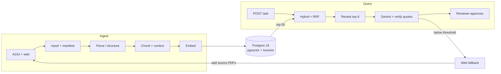

# Ontario Injury Law Guide — Design Doc

Sep 25, 2026 · Yichi Zhang · Live version: https://claude.ai/artifact/1eXMcx8vLmKPCRgCxgPpLn

We will build a research guide to Ontario personal-injury law, plaintiff side and Toronto-focused, for paralegals and law students: browse every relevant law, search it in everyday or legal words, and ask research questions whose answers a human reviewer approves before release. It is a portfolio demo. v0 covered 12 statutes and regulations (2,946 sections), since grown to 20 (3,871 sections: 15 statutes, 5 regulations); v1 adds Ontario Court of Appeal and Supreme Court of Canada decisions from the open A2AJ dataset.

## Goals and non-goals

A paralegal or law student new to Ontario injury law should be able to find the laws that apply, understand them quickly, and get research answers a reviewer has approved — with every statement traceable to the official text.

**Goals**

1. Topic guides for 5 practice areas: the deadlines, elements and laws that apply, in plain but precise language.
2. Browse every law in the corpus, with a plain-language summary beside the official text.
3. Search laws, cases, guides and glossary from one box, in everyday words ("slip and fall") or legal ones ("occupier", "s. 4").
4. Answer research questions with verified quotes and pinpoint citations; say "not found" instead of guessing.
5. Human in the loop: a reviewer approves, edits or rejects every chat answer before the researcher sees it.
6. Ingest open bulk data (A2AJ) plus targeted web and Chrome fetches into `input/` with provenance, idempotently.
7. Measure retrieval, answer, summary and review quality in Langfuse, gated in CI.

**Non-goals (v1)**

- Advice to the public, outcome predictions or claim values.
- A deadline calculator: guides state the rules, never a computed date.
- Other provinces, criminal, employment, and family law beyond injury-related family claims.
- Bulk scraping CanLII or any login- or paywall-gated source.
- French.
- A public launch: this is a portfolio demo with two seeded roles (researcher, reviewer) — no real accounts, billing or fine-tuning.

## Requirements

The binding targets are citation accuracy ≥ 95% and p95 answer latency under 8 s at 1M pages.

| Area | Requirement | Target |
| --- | --- | --- |
| Corpus size | Pages indexed without code changes | 1M pages (~3M chunks) |
| Ingestion throughput | Pages per hour, one worker box | ≥ 20k (text), ≥ 2k (OCR) |
| Freshness | New file in `input/` searchable | < 5 min |
| Query latency | p95 time to sources / draft answer | < 2 s / < 8 s |
| Retrieval quality | recall@8 on gold set | ≥ 0.85 |
| Citation accuracy | Cited span supports the claim (judge + spot check) | ≥ 95% |
| Refusal | Out-of-scope questions correctly refused | ≥ 90% |
| Idempotency | Re-ingesting the same file | No new rows, no new embeddings |
| Provenance | Every chunk traces to a source URL and hash | 100% |

Targets are initial guesses; phase 2 baselines will reset them.

## Architecture

Two paths share one Postgres: an async ingest path that turns documents into indexed chunks, and a query path that retrieves, reranks and drafts answers with verified citations for human review.



When no chunk clears the relevance threshold, the answer comes from the web instead — labelled as such — and the user can pull those sources into `input/`, closing the loop.

| Component | Choice | Why |
| --- | --- | --- |
| API | FastAPI | Async, streaming responses, typed |
| Frontend | Next.js (static law, case and guide pages) + Tailwind | Fast, shareable, indexable pages |
| Queue / workers | Redis 8 Streams + consumer groups; job records in Postgres | Fast dispatch and worker scale-out; Postgres keeps the durable job state (see Job queue) |
| Parsing | A2AJ arrives pre-structured; Docling for PDFs and HTML | One tool for layout, tables and OCR; MIT licence |
| Store | Postgres 18 + pgvector 0.8 (HNSW) + tsvector + pg_trgm | Vectors, keywords, typeahead, metadata and job records in one system |
| Embeddings | gemini-embedding-2 at 1536 dims | Multimodal, 8,192-token input, MRL down-sizing; one content per request, so bulk runs use a thread pool (3,259 chunks in 2 min) or a Vertex batch job |
| Reranker | gemini-3.5-flash-lite, listwise (JSON ranking of passage ids) | One vendor, one auth path; tuned by eval |
| Chunk context | gemini-3.5-flash-lite + context caching | Cheapest per-chunk summaries |
| Answers + plain summaries | gemini-3.7-flash (low thinking) + verified quotes | Reliable 1–3 s on Vertex global; citations checked in code |
| Web fallback | Grounding with Google Search | Built into Gemini |
| Evals + tracing | Langfuse Cloud (managed) | Datasets, experiments, LLM judges and traces in one place; nothing to run or upgrade |
| Deploy | Docker Compose | `docker compose up` runs everything |

**Google Cloud access.** All Gemini calls go through Vertex AI (Google Cloud credits), authenticated with Application Default Credentials — no Google API keys anywhere. The only keys in the project are Langfuse Cloud's public/secret pair, read from the environment (local `.env`, gitignored; CI secrets), never committed. Traces hold questions and public law text only — no personal data is sent.

- One client everywhere: `google-genai` with `genai.Client(vertexai=True, project=GOOGLE_CLOUD_PROJECT, location="global")`.
- Local: `gcloud auth application-default login` + `gcloud auth application-default set-quota-project <project>`. CI/deploy: attached service account or Workload Identity Federation — never a key file.
- Service account role: `roles/aiplatform.user` only.
- Bulk work uses Vertex batch prediction jobs via a GCS bucket; recheck Vertex pricing before bulk runs.
- `scripts/check_vertex.py` smoke-tests generation (3.7 Flash, 3.5 Flash-Lite), a 1536-dim embedding, structured claims with quote verification, Google Search grounding, and a Flash-Lite listwise rerank — 6/6 passing on Sept 25, 2026.

**Model call rules (learned in testing):** 3.7 Flash, not 3.8 — 3.8 Flash is only served from `global` (404 in `us-central1`) and timed out (504) on most calls on Sept 25, 2026. Always set `thinking_level="low"` unless a task needs deep reasoning: with default thinking, grounding kept searching until the deadline. Every call has a 30 s timeout and SDK retries on 429/5xx. Grounding source URLs are Vertex redirects and must be resolved before storing.

## Acquisition

A2AJ's open Parquet datasets are the primary source; the web and Chrome flow only fills the Toronto layer and one-off documents. Everything lands in `input/` with a line in `input/manifest.jsonl`.

| Source | What | Access | Stage |
| --- | --- | --- | --- |
| [a2aj/canadian-laws](https://huggingface.co/datasets/a2aj/canadian-laws) | ~20 Ontario injury statutes and regulations, pre-split into sections | Hugging Face Parquet, weekly | v0 |
| toronto.ca | Toronto Municipal Code ch. 719 (Snow and Ice Removal), 743 (Streets and Sidewalks), 629 (Property Standards) | Approved download (2.6 MB PDFs, text layer, `pdftotext`); **City copyright: local index only — UI shows excerpts + link, never full text** (`documents.reproduction = 'excerpt'`). Plain-language summaries of these sections stay (decided 2026-09-27, #16): they are our own paraphrase of the rule, not a reproduction, and are labelled AI-written with the official link | v0 |
| [a2aj/canadian-case-law](https://huggingface.co/datasets/a2aj/canadian-case-law) | ONCA (24,131 decisions, 1998–2026) and SCC (10,893, 1877–2026), filtered to injury topics | Hugging Face Parquet, with citation lists | v1 |
| [CanLII API](https://github.com/canlii/API_documentation/blob/master/EN.md) | Superior Court and LAT case metadata and links | API key, per request | v1, links only |
| CanLII full text | Superior Court and LAT decisions | Bulk download prohibited by [CanLII terms](https://www.canlii.org/info/terms.html) | Not requested |

**v0 statutes and regulations:** Limitations Act, 2002 · Negligence Act · Occupiers' Liability Act · Dog Owners' Liability Act · Insurance Act and O. Reg. 34/10 (SABS) · Highway Traffic Act (liability parts) · Courts of Justice Act · Rules of Civil Procedure (R.R.O. 1990, Reg. 194) · Family Law Act (Part V) · City of Toronto Act, 2006 (notice to the city) · Workplace Safety and Insurance Act, 1997.

**Added after v0 (issue #6):** Municipal Act, 2001 (s. 44 non-repair and notice outside Toronto) · Trespass to Property Act · Motor Vehicle Accident Claims Act · Compulsory Automobile Insurance Act · Health Insurance Act (ss. 30–31 OHIP subrogation) · O. Reg. 461/96 (court proceedings for auto accidents; "permanent serious impairment") · O. Reg. 239/02 and O. Reg. 612/06 (minimum maintenance standards for municipal and Toronto highways).

**Case filter (v1):** keep decisions that cite a v0 statute (A2AJ citation lists) or match injury terms. Expected: a few thousand decisions — to confirm.

**Manifest line**

```json
{"url": "...", "source": "a2aj-caselaw", "title": "...", "neutral_citation": "2024 ONCA 123", "jurisdiction": "ON", "doc_type": "decision", "date": "2024-03-01", "upstream_license": "...", "sha256": "...", "fetched_at": "..."}
```

**Rules:** bulk datasets before scraping; no bulk or programmatic download from CanLII (it is suing Caseway AI over exactly that); respect each document's `upstream_license`; robots.txt and ≤ 1 request/s per domain; approval table before every web or Chrome download batch; never enter credentials.

## Ingestion and chunking

Chunks follow the law's own structure — Act > Part > section > subsection for statutes, numbered paragraphs for decisions — so every citation can pinpoint "s. 4(1)" or "at para 45".

1. **Load** — weekly job pulls new A2AJ Parquet; a watcher on `input/` picks up web downloads. Unchanged `sha256` = skipped.
2. **Parse** — A2AJ laws arrive as Markdown + JSON section map, decisions as text with numbered paragraphs: no parsing. Only toronto.ca pages and ad-hoc PDFs go through Docling; failures go to Gemini Flash.
3. **Chunk** — statutes: one chunk per section, split by subsection past ~800 tokens. Decisions: windows of whole paragraphs, ~500 tokens. Each chunk keeps its pinpoint.
4. **Contextualize** — gemini-3.5-flash-lite writes 1–2 sentences placing the chunk, with the document in a cached prefix.
5. **Summarize for the guide** — gemini-3.7-flash writes a grade-10 summary per section and per decision (facts, outcome, why it matters), stored with the source hash.
6. **Extract citations** — A2AJ citation lists plus regex for neutral citations and statute references, into `citations`.
7. **Embed + index** — gemini-embedding-2 (batch); vector, tsvector and metadata in one transaction.

**Failure handling:** a job retries 3 times with backoff, then is dead-lettered with its error and stage, visible at `GET /ingest/{job_id}`. A document is searchable only after all its chunks commit.

### Job queue

Redis dispatches work; Postgres remembers it. This follows the Hello Interview guidance on Redis queues and Slack's lesson that Redis should hold dispatch state, not the durable backlog.

1. **Enqueue** — insert an `ingest_jobs` row (`queued`) in Postgres, then `XADD` its id to the `ingest` stream. The job id is derived from `(kind, url)`, so a duplicate enqueue is a no-op (the page's sha256 is only known after the fetch; loading is keyed on it).
2. **Dispatch** — workers read with `XREADGROUP` in one consumer group; each entry stays in the pending list until the worker `XACK`s it after the data commits.
3. **Recover** — a sweeper calls `XAUTOCLAIM` for entries idle > 5 min (dead or stuck worker). A reconciler re-adds any `queued` rows older than 5 min that Redis lost, so a Redis crash or flush loses no work.
4. **Retry / dead-letter** — failures increment `attempts` with backoff (1, 4, 16 min); after 3, status `dead` with `error` and `stage`, and the entry moves to an `ingest:dead` stream for inspection.
5. **Idempotent jobs** — delivery is at-least-once; every stage checks `sha256` / text hash before writing, so re-running a job adds no rows and no embeddings.

**Redis config:** AOF on (`appendfsync everysec`), `maxmemory` with `noeviction` so a full Redis rejects enqueues loudly instead of dropping jobs; stream capped with `XADD MAXLEN ~ 100000`. Queue depth, pending count and oldest-pending age are readable with `XLEN` / `XPENDING` and the `ingest_jobs` table (not exported as metrics in the demo).

**Add-to-corpus (6.2).** A reviewer adds an official page from a web-fallback answer: https on ontario.ca, canada.ca, ontariocourts.ca, scc-csc.ca or toronto.ca only (redirects checked too), robots.txt obeyed, ≤ 1 request/s per host. Stages `fetch → parse → load → chunk → embed`; the file is kept in `input/web/` with a manifest line; HTML is split on h2/h3 headings (menus and link-only blocks dropped), PDFs by page; toronto.ca stays excerpt-only. Refusals (domain, robots.txt, 4xx, unsupported type) are permanent: `dead` at once, no retries. Added pages are kind `web`. The domain allowlist says nothing about relevance (a Transport Canada drone page passed it, #8), so the reviewer must tick "This page is about Ontario personal-injury law": `POST /ingest {url, in_scope: true}` (422 without it) and `ingest_jobs.scope_confirmed_by` records who. `DELETE /laws/{slug}` (reviewers only, kind `web` only, 409 for any other law) removes a page with its sections, chunks and job row; the file and manifest line in `input/` stay. Pages list under "Official web pages" with their title, their domain as secondary text and "fetched <date>" (`documents.date`) where laws show "as of <in-force date>".

## Retrieval

Measured in Phase 3 against the gold set (`docs/iterations.md` has every delta, kept or reverted).

1. **Filter** — in-force versions only by default; jurisdiction (Ontario + SCC), doc type, court, date.
2. **Retrieve** — top 50 keyword (terms OR'ed, `ts_rank_cd`) + top 50 pgvector.
3. **Fuse** — weighted reciprocal rank fusion, `score = Σ w / (10 + rank)`, keyword weight 0.3, vector 1.0. (k 60 with equal weights buried vector #1 hits under broad keyword matches: recall@8 0.887 → 1.000, MRR 0.624 → 0.847.)
4. **Chunk context** — gemini-3.5-flash-lite writes 1–2 situating sentences per chunk (law title + Part outline); used in the embedding input only. Fused MRR 0.847 → 0.895.
5. **Rerank** — gemini-3.5-flash-lite orders the fused top 20 (ids + first ~120 words) in one JSON call; keep top 8; it may reorder but not drop the fused top 3; errors/timeouts (2.5 s deadline) fall back to fused order. MRR ~0.91–0.92. Runs in the background before drafting, so it adds nothing to the researcher's wait. (Top 30 was slower and no better.) `/search` is progressive: the page renders the fused results at once, then fetches `/search?rerank=true` (same hits, reranked with the same fast client and fallback; the query embedding is cached per process) and swaps the list in place. Fused order put Limitations Act s. 4 5th for "how long to sue" (#41). First results p50 0.3 s, reranked order p50 1.6 s. The swap remounts the list instead of moving nodes: moving them measured CLS 0.19, the remount 0.
6. **Authority boost** — (Phase 5) small boost for SCC/ONCA and often-cited decisions; demote overturned ones.
7. **Expand context** — attach section heading or neighbouring paragraphs.

**Lanes.** Each kind of source is ranked on its own and never competes with the laws: the law lane (statutes, regulations, by-laws: `RETRIEVAL_KINDS`) gives the top 8; decisions the top 4 (mixing them in dropped statute recall@8 1.000 → 0.935); web pages a reviewer added the fused top 2, kept only within the grounding-gate distance (0.30), because in the law lane an ontario.ca Small Claims page outranked Limitations Act s. 4 for "how long to sue" (#8). The grounding gate reads law hits only. `/search` lists the law groups first, then web pages labelled "Official web page · domain". The batch jobs (situate, summarize) still process web pages (`ingest.chunks.LAW_KINDS`).

Tried and dropped: a curated synonym table on the keyword side (no gain once fusion was fixed; re-tried for #41, it did not fix "how long to sue": `ts_rank_cd` favours long chunks, so s. 4 stayed out of the keyword top 50, and length normalization that fixed it cost fused MRR 0.864 → 0.846).

## Answering

gemini-3.7-flash answers only from the top 8 chunks, and code — not the model — decides which citations survive.
`POST /ask` returns the fused sources in well under a second (p95 0.8 s) and drafts in a background task (rerank → generate → verify; p50 4.6 s, p95 10.9 s): the researcher never sees the draft before review, so only the reviewer waits for it. A failed draft is flagged in the review queue.

- **Quote verification** — model returns `claims: [{text, chunk_id, quote}]`; code checks each quote is an exact (whitespace-normalized) substring of its chunk. Failing claims are dropped and retried once; two failures → refusal path.
- **Grounding gate** — best vector distance above 0.30 → "not found in the laws we cover" + 3 closest passages, no model call (0.30 from the gold set: refuses 7/15 out-of-scope, 0 in-scope).
- **Answer shape** — plain answer in 2–3 sentences, then "what the law says" with quotes, then any deadline rule.
- **Canadian citations** — *Limitations Act, 2002*, SO 2002, c 24, Sched B, s 4; *Smith v Jones*, 2024 ONCA 123 at para 45.
- **Decomposition** — compound questions split by Flash-Lite into sub-queries.
- **Web fallback** — opt-in Grounding with Google Search, labelled "from the web, not our law library", URLs resolved from Vertex redirects, offer to fetch into `input/`.
- **Guardrails** — never says whether someone has a case, predicts outcomes or values a claim; out-of-scope topics named; answers are research aids released only after human review.

## Human review

Every chat answer is a draft until a reviewer approves it, mirroring supervised legal work.

1. **Draft** — agent drafts with verified quotes, stored `pending_review`. Researcher sees "Awaiting review" plus the retrieved sources right away.
2. **Queue** — reviewer sees question, each claim beside its verified quote and source link, rerank scores, dropped claims, web-fallback use. Risky drafts flagged first.
3. **Decide** — approve; edit with required note; or reject with a reason (wrong law, missing authority, unsupported claim, out of scope).
4. **Release** — "Reviewed by <name> on <date>" (+ "edited by reviewer").
5. **Learn** — decisions logged to Langfuse as scores; edited/rejected answers become gold-set candidates.

Tracked weekly: approval rate, edit rate, median time to review. No auto-release in v1. Demo seeds two users (researcher, "Demo Reviewer") with a role switch; the demo pauses at review until the reviewer acts.

## Frontend

A research guide first, chatbot second. Should feel like a well-kept law library — quiet, precise, obviously trustworthy.

**Principles**

1. Official text is the authority; summaries sit beside it, labelled "AI-written, checked against the official text".
2. Deadlines first, stated as rules (no calculator).
3. Provenance everywhere: "Official text as of <date> · Source: Ontario e-Laws via A2AJ"; copy-citation button (McGill style).
4. Plain first, precise always: summaries ≤ grade 10; legal terms keep their names, with glossary tooltips.
5. Honest limits and review status shown in the UI.

**Pages**

| Page | Purpose | Key elements |
| --- | --- | --- |
| Home | Pick a practice area | 5 topic cards, search box, recent reviewed answers |
| Topic guide | One practice area | Deadlines, elements, laws that apply, leading cases, scoped Ask box |
| Law library | See every law | Act → Part → section tree; in-force date; "cited by N cases" |
| Section page | One provision | Official text with legislative indentation, summary, glossary terms, interpreting cases, permalink `/laws/limitations-act-2002/s-4` |
| Case page | One decision | Plain summary, numbered paragraphs, cites and cited-by |
| Search | Find anything | Grouped Guides · Laws · Cases · Glossary, filters |
| Ask | Research questions | Sources at once; answer when reviewed, citation chips open passage in side panel |
| Review queue | Reviewer only | Claims beside verified quotes, risk flags, approve / edit / reject |
| Glossary | Legal words | ~100 terms linked to sections |

**Topic guides (v0, proposed):** Motor vehicle accidents (tort + accident benefits) · Slip and fall on private property · Claims against the City of Toronto · Dog bites · Limitation periods.

**Search:** one box everywhere, `/` or `⌘K` palette; typeahead via `pg_trgm`; typing a citation (`s. 4`, `2024 ONCA 123`) jumps to it; Enter runs hybrid retrieval grouped by type; question-shaped queries offer "Ask this".

**Visual design:** serious, editorial, calm. No stock photos, gradients, emoji, gavels or chatbot avatars.

| Role | Choice |
| --- | --- |
| Headings + law text | Source Serif 4 — law text 19px / 1.6, measure 68ch |
| UI + summaries | Source Sans 3 — 16px minimum |
| Citations + section numbers | Source Code Pro, tabular figures |
| Ink | #1A2233 light · #E8E6E1 dark |
| Paper | #FAF8F4 light · #14171C dark |
| Official-text panel | #F3EFE6 · #1F2229 |
| Primary | #1F3A5F · #9DB4D6 |
| Deadline accent (sparingly) | #7A1F2B · #E0A2A9 |
| Rules + borders | #D9D4CA · #2E333B |

Hanging indents for 1 / (a) / (i); 150 ms fades only, reduced-motion respected; print stylesheet; all colour pairs verified WCAG 2.2 AA before build.

**Engineering bar:** Next.js App Router + RSC, static law/case/guide pages regenerated weekly; Radix primitives with own tokens; Lighthouse CI budgets (LCP < 1.5 s on 4G, < 100 KB JS on law pages, CLS < 0.05, a11y 100); keyboard-complete; Playwright flows: topic → deadline → section, search → section, ask → review → open citation.

## Data model and API

| Table | Key columns |
| --- | --- |
| `documents` | id, sha256 (unique), kind, title, short_name, neutral_citation, court, jurisdiction, date, in_force_from, in_force_to, supersedes_id, url, source, upstream_license |
| `sections` | id, document_id, parent_id, pinpoint, heading, text, plain_summary, summary_source_hash, sort_order |
| `chunks` | id, document_id, section_ids, pinpoint, text, context, tsv, embedding halfvec(1536), embedding_model |
| `citations` | citing_document_id, cited_document_id, cited_pinpoint, treatment |
| `answers` | id, trace_id, asked_by, question, draft_markdown, claims (jsonb), flags, status, reviewed_by, reviewed_at, review_reason, review_note, final_markdown |
| `users` | id, name, role (researcher, reviewer) |
| `glossary_terms` | term, plain_definition, section_ids |
| `guides` | slug, title, body_markdown, reviewed_by, reviewed_at |
| `synonyms` | novice_term, legal_terms |
| `ingest_jobs` | id, kind, document_sha256, status (queued, running, done, dead), stage, attempts, error, enqueued_at, updated_at |

Indexes: HNSW on `embedding`, GIN on `tsv`, GIN trigram on titles/headings/terms, btree on `(kind, court, date)` and `(document_id, sort_order)`.

| Endpoint | Does |
| --- | --- |
| `GET /laws`, `GET /laws/{slug}`, `GET /laws/{slug}/{pinpoint}` | Library tree, Act, section |
| `GET /cases/{citation}` | One decision |
| `GET /suggest?q=`, `GET /search?q=&type=` | Typeahead; grouped hybrid search |
| `POST /ask` | Sources now + answer id in `pending_review` |
| `GET /answers/{id}`, `GET /review/queue`, `POST /answers/{id}/review` | Review workflow |
| `GET /guides/{slug}`, `GET /glossary` | Topic guides, glossary |
| `POST /ingest` (reviewer, `in_scope: true`), `GET /ingest/{job_id}`, `DELETE /laws/{slug}` (reviewer, web pages only) | Ingestion; remove an added page |

## Evals

Langfuse Cloud is the eval and tracing layer: gold set = Dataset, eval run = Experiment, every `/ask` = trace. No retrieval or prompt change merges without matching or beating the main-branch baseline.

**Gold set** `ontario-injury-gold` (~100): ~60 statute questions with fixed answers; ~25 case-law questions (not expert-checked: reported separately as "unverified", not a CI gate); ~15 out-of-scope questions that must be refused. **Summary evals:** 50 sampled summaries — LLM-judge faithfulness, code-scored reading grade ≤ 10.

| Metric | Mechanism |
| --- | --- |
| recall@8, MRR | Code evaluator reading the retrieval span |
| Citation accuracy, faithfulness | LLM-as-a-judge on the answer observation (judge ≠ answer model) |
| Refusal rate | Code evaluator on out-of-scope items |
| Latency, cost | From trace timings and token usage |
| Reviewer decisions | Scores on the trace: decision, reason, edit distance |

**CI:** GitHub Actions runs `pytest` and the Playwright flows on every push against a small committed fixture corpus (fake model, no Vertex). `make eval` runs locally (needs Vertex + Langfuse): both experiments on the gold set, compared with `evals/baseline.json`; it fails if a metric drops > 2 points (LLM-judge metrics: > 2 sd of the difference between one run and the baseline's mean of 3 runs, ≈ 6.7 points for faithful, 3.7 for citation support — see docs/evals.md), if an item fails, or if the corpus or gold-set hash changed. Use observation-level and experiment evaluators (trace-level ones are being retired in Langfuse v4).

## Scaling to 100M pages

The real corpus is small (~20 Acts + a few thousand decisions); 100M pages is a thought experiment. Bottlenecks there: vector memory and contextualization cost. Approximate: ~500 tokens and ~3 chunks per page, 1536-dim vectors, Gemini API list prices (recheck on Vertex).

| Quantity | 1M pages | 100M pages |
| --- | --- | --- |
| Chunks | ~3M | ~300M |
| Vectors, halfvec (3 KB) | ~9 GB | ~900 GB |
| Vectors, binary (192 B) | ~0.6 GB | ~58 GB |
| Embedding (batch) | ~$50 | ~$5k |
| Contextualization, Flash-Lite cached | ~$1.5k | ~$150k |
| Same, batch + outline-only | ~$0.5k | ~$50k |

At scale: binary-quantized first pass + halfvec rescore; shard or move vectors past ~50–100M; batch + outline-only contextualization; separate OCR queue; `embedding_model` column for zero-downtime re-embeds; `supersedes_id` + in-force dates for amended law.

## Trade-offs

| Decision | Chosen | Alternative | Why |
| --- | --- | --- | --- |
| Jurisdiction | Ontario, Toronto-focused | British Columbia | Chosen angle; BC has open trial decisions but Ontario has the audience |
| Audience | Paralegals and law students | Public | Fits a review workflow; precision over hand-holding |
| Release | Human review of every answer | Auto-release | Mirrors supervised legal work; review data improves evals |
| Product | Guide + library + search | Chatbot only | Browsing builds understanding and trust |
| Chunking | Sections and paragraphs | Fixed windows | Pinpoint citations |
| Search | Hybrid + RRF + rerank | Pure vector | Legal terms and everyday words both matter |
| Store | Postgres 18 for data, vectors and job records | Pinecone | One system for search and metadata |
| Queue | Redis Streams, job state in Postgres | Procrastinate (Postgres queue) | Faster dispatch and worker scale-out; costs a second service and non-transactional enqueue, covered by the reconciler |
| Parsing | A2AJ + Docling | PyMuPDF | OCR/layout in one tool; MIT vs AGPL |
| Models | Gemini 3.7 Flash via Vertex + quote verification | Claude + Citations API | Cloud credits, one vendor; verification doubles as an eval |
| Rendering | Static pages + client islands | SPA | Fast, indexable, printable |

## Decisions, risks, open questions, milestones

**Decided (Sept 25, 2026):** audience = paralegals and law students · portfolio demo · human reviewer approves every answer · no deadline calculator · no CanLII research access request (link out) · no French · gemini-embedding-2 at 1536 · Flash-Lite listwise reranker · gemini-3.7-flash for answers · Vertex AI via ADC · Redis Streams job queue with job state in Postgres.

**Risks:** summaries oversimplify → judge + review + official text beside · review bottleneck → risk-first queue, sources shown immediately · Ontario trial-level gap → stated in UI · law changes → weekly refresh, hash-triggered re-summaries · quote verification too strict → normalize, track drop rate · Vertex model availability → smoke test first, explicit models, retries · Redis loses or stalls jobs → AOF, `noeviction`, Postgres job records + reconciler, `XAUTOCLAIM` sweeper.

**Open questions**

- [x] Confirm the 5 topic guides — confirmed Sep 25, 2026.
- [x] Reviewer — "Demo Reviewer" (played by the author); case-law gold answers not expert-checked, labelled unverified. Decided Sep 25, 2026.

**Milestones**

| Phase | Delivers | Exit criterion |
| --- | --- | --- |
| 1 | 12 Ontario statutes and regulations + Toronto layer ingested; law library + section pages; `/ask` drafts + review queue | Every section browsable; one reviewed answer with a verified quote |
| 2 | Gold set + Langfuse experiments in CI; review decisions logged | Baseline recorded |
| 3 | Typeahead, synonyms, hybrid, rerank, context | Each step's eval delta recorded |
| 4 | 5 topic guides, summaries, glossary, visual design pass | Summaries ≥ 95% faithful, grade ≤ 10; Lighthouse green |
| 5 | ONCA + SCC decisions, citation graph, case pages | Case-law gold questions pass (reported as unverified) |
| 6 | Web fallback (reviewed) + add-to-corpus; load test | Fallback labelled and ingestible; p95 vs targets |

## Sources

- [A2AJ canadian-laws](https://huggingface.co/datasets/a2aj/canadian-laws) · [A2AJ canadian-case-law](https://huggingface.co/datasets/a2aj/canadian-case-law) · [A2AJ GitHub](https://github.com/a2aj-ca/canadian-legal-data)
- [CanLII Terms](https://www.canlii.org/info/terms.html) · [CanLII API](https://github.com/canlii/API_documentation/blob/master/EN.md) · [CanLII v. Caseway AI](https://amp.cbc.ca/news/canada/british-columbia/canlii-lawsuit-caseway-ai-1.7374964)
- [Gemini models](https://ai.google.dev/gemini-api/docs/models) · [Gemini embeddings](https://ai.google.dev/gemini-api/docs/embeddings) · [Gemini pricing](https://ai.google.dev/gemini-api/docs/pricing)
- [pgvector](https://github.com/pgvector/pgvector) · [Docling](https://arxiv.org/pdf/2501.17887) · [Langfuse LLM-as-a-Judge](https://langfuse.com/docs/evaluation/evaluation-methods/llm-as-a-judge)
